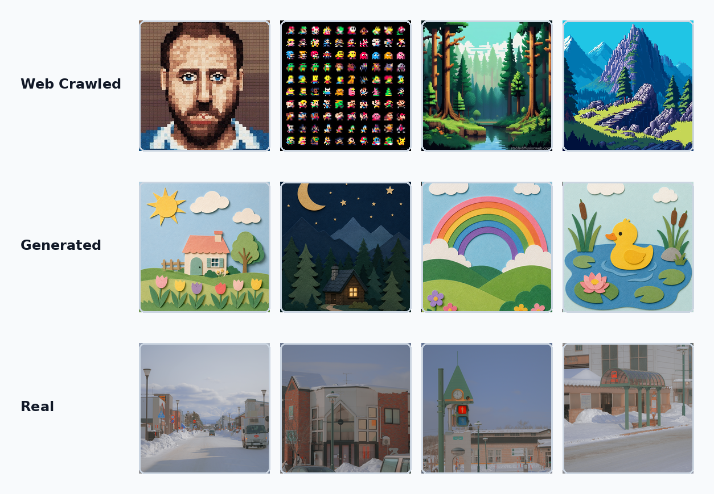
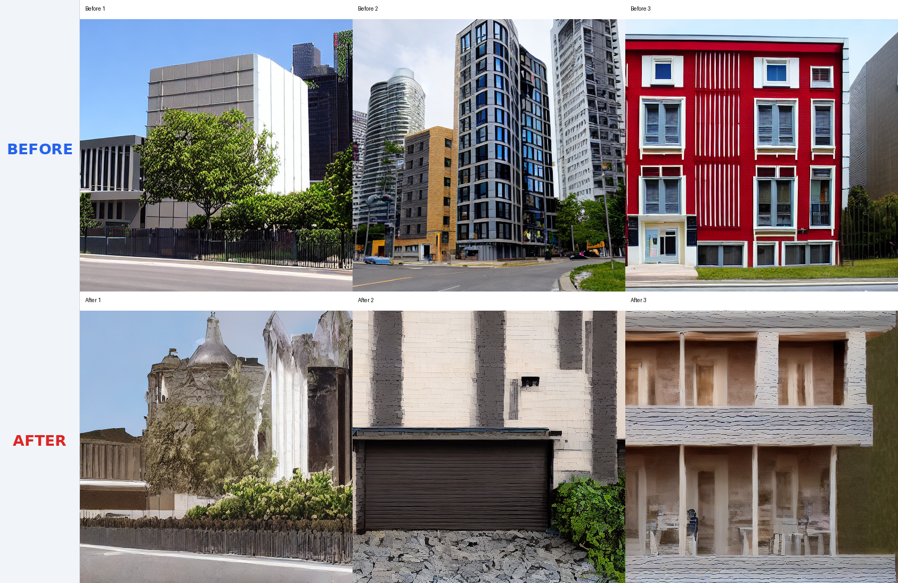
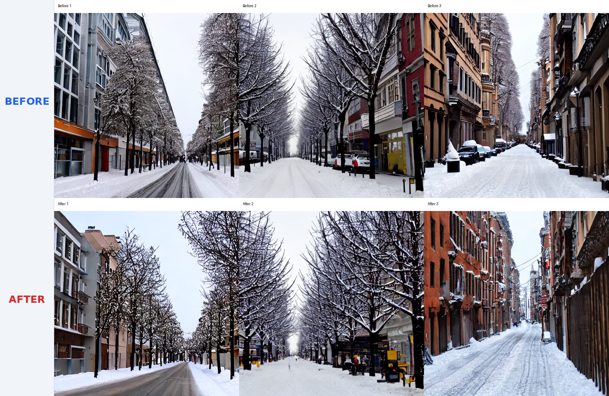
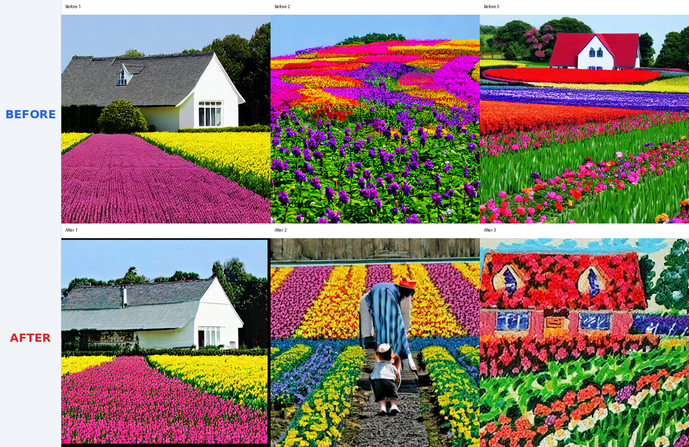
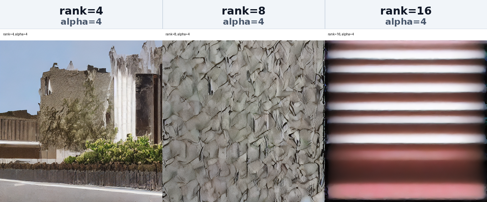
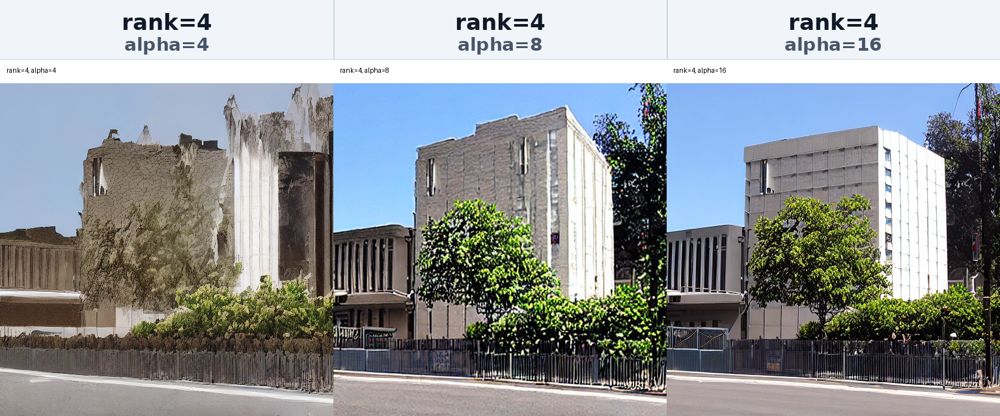

<div align="center">

# 🎨 Customizing LoRA for Diffusion Models

**Stable Diffusion LoRA experiment suite** — fine-tunes Stable Diffusion v1.5 adapters on custom image datasets and compares dataset source, rank, and alpha effects.

<br>

[](https://www.python.org/) [](https://pytorch.org/) [](https://huggingface.co/docs/diffusers/) [](https://huggingface.co/docs/datasets/) [](#license)

<br>

[Features](#features) · [Quick Start](#quick-start) · [Usage](#usage) · [Architecture](#architecture) · [Experiment Results](#experiment-results) · [Dependencies](#dependencies) · [License](#license)

</div>

---

<a id="features"></a>

## ✨ Features

- **Dataset-source comparison** — trains matching LoRA settings on web-crawled images, real photos, and AI-generated images.
- **Rank and alpha ablations** — compares LoRA capacity settings across fixed prompts and checkpoint intervals.
- **Captioned imagefolder datasets** — stores each training split with Hugging Face `imagefolder` metadata in `metadata.csv`.
- **Before-after generation grids** — renders base-model and LoRA outputs side by side for visual evaluation.
- **Reusable training utilities** — centralizes loading, preprocessing, training, inference, and grid export in `experiment_utils.py`.
- **Report-ready artifacts** — saves labeled figures, summary CSVs, checkpoints, and final adapter weights.

---

<a id="quick-start"></a>

## 🚀 Quick Start

### 1. Environment setup

```bash
git clone https://github.com/192cm/Customizing-LoRA-for-Diffusion-Models.git
cd Customizing-LoRA-for-Diffusion-Models
conda env create -f environment.yml
conda activate genai-assignment2
python -m ipykernel install --user --name genai-assignment2 --display-name "genai-assignment2"
```

### 2. Credentials / config

```bash
python -c "from diffusers import StableDiffusionPipeline; StableDiffusionPipeline.from_pretrained('runwayml/stable-diffusion-v1-5')"
```

Hugging Face provides a free account tier if model access or cached downloads require authentication in your environment.

### 3. Run

```bash
jupyter notebook 00_Customizing_LoRA.ipynb
```

---

<a id="usage"></a>

## 📖 Usage

### Notebooks

Run the notebooks in order when reproducing the full experiment.

| Step | Notebook | Output |
|------|----------|--------|
| 1 | `00_Customizing_LoRA.ipynb` | End-to-end LoRA workflow validation |
| 2 | `01_dataset_training.ipynb` | Dataset-wise LoRA adapters and before-after grids |
| 3 | `02_ablation_rank.ipynb` | Rank `8` and `16` comparison artifacts |
| 4 | `02_ablation_alpha.ipynb` | Alpha `8` and `16` comparison artifacts |
| 5 | `03_test.ipynb` | Additional inference and checkpoint tests |
| 6 | `04_monitor.ipynb` | Experiment-state and artifact inspection |

```bash
jupyter notebook
```

> Use the `genai-assignment2` kernel before running cells that import `diffusers`, `accelerate`, or `torch`.

### Programmatic

Import the shared helpers when running a smaller training or inference pass from a Python script.

```python
from experiment_utils import DATASET_CONFIGS, run_lora_training_experiment

dataset_config = DATASET_CONFIGS[0]
```

### Dataset Format

Each dataset follows the Hugging Face `imagefolder` layout.

```text
data/{dataset_name}/
└── train/
    ├── metadata.csv
    ├── image_01.jpg
    └── image_02.png
```

`metadata.csv` uses one row per image.

```csv
file_name,caption
image_01.jpg,a sks building in pixel art style
```

| Dataset | Folder | Images | Prompt | Style token |
|---------|--------|-------:|--------|-------------|
| `web_crawled` | `data/web_crawled_custom_dataset` | 50 | `a building` | `sks` |
| `real` | `data/real_custom_dataset` | 10 | `a city street in winter` | `sks` |
| `generated` | `data/generated_custom_dataset` | 20 | `a house in a flower field` | `sks` |

---

<a id="architecture"></a>

## 🏗️ Architecture

```
Customizing-LoRA-for-Diffusion-Models/
├── 00_Customizing_LoRA.ipynb        # baseline workflow
├── 01_dataset_training.ipynb        # dataset comparison
├── 02_ablation_rank.ipynb           # rank experiments
├── 02_ablation_alpha.ipynb          # alpha experiments
├── 03_test.ipynb                    # inference checks
├── 04_monitor.ipynb                 # artifact inspection
├── experiment_utils.py              # training utilities
├── environment.yml                  # conda environment
├── data/                            # imagefolder datasets
├── lora_experiments/                # checkpoints and grids
├── report_assets/                   # labeled report figures
└── sd_lora/                         # single-run adapter output
```

```
Custom images
   │  image files and captions
   ▼
data/*/train ──▶ Hugging Face imagefolder dataset
                    │  tensors and tokenized captions
                    ▼
             experiment_utils.py ──▶ Stable Diffusion v1.5
                    │  LoRA state dicts and checkpoints
                    ▼
          lora_experiments/* ──▶ comparison grids and CSV summaries
```

> The repository keeps experiment orchestration in notebooks while sharing training and inference behavior through `experiment_utils.py`.

---

<a id="experiment-results"></a>

## 🤖 Experiment Results

### Dataset Samples



### Before / After LoRA Fine-tuning

| Web-crawled | Real photos | AI-generated |
|:-----------:|:-----------:|:------------:|
|  |  |  |

### Ablation Study

| LoRA rank | LoRA alpha |
|:---------:|:----------:|
|  |  |

### Training Settings

| Key | Value |
|-----|-------|
| Base model | `runwayml/stable-diffusion-v1-5` |
| VAE | `stabilityai/sd-vae-ft-mse` |
| Variant | `fp16` |
| Seed | `2015` |
| Resolution | `512` |
| Batch size | `8` |
| Max train steps | `2000` |
| Checkpoint interval | `500` |
| Learning rate | `1e-4` |
| Default LoRA rank | `4` |
| Default LoRA alpha | `4` |
| Target modules | `to_k`, `to_q`, `to_v`, `to_out.0` |

### Output Paths

| Path | Contents |
|------|----------|
| `lora_experiments/dataset_training/*/rank4_alpha4/` | Dataset comparison adapters and checkpoints |
| `lora_experiments/ablation/rank/` | Rank ablation adapters and checkpoints |
| `lora_experiments/ablation/alpha/` | Alpha ablation adapters and checkpoints |
| `lora_experiments/comparisons/` | Raw before-after comparison grids |
| `lora_experiments/experiment_summary_rank.csv` | Rank experiment summary |
| `lora_experiments/experiment_summary_alpha.csv` | Alpha experiment summary |
| `report_assets/` | Labeled figures for reports |

---

<a id="dependencies"></a>

## 📦 Dependencies

| Package | Version | Role |
|---------|---------|------|
| `python` | `3.10` | Runtime |
| `torch` | `2.1.2+cu121` | Training and inference backend |
| `torchvision` | `0.16.2+cu121` | Image transforms |
| `diffusers` | `0.26.0` | Stable Diffusion pipeline and LoRA loading |
| `accelerate` | `0.26.1` | Training orchestration |
| `peft` | `0.7.1` | LoRA configuration and state dict handling |
| `datasets` | `2.16.1` | `imagefolder` dataset loading |
| `transformers` | `4.37.0` | Tokenizer and text encoder loading |
| `safetensors` | `0.4.2` | Adapter weight serialization |

---

<a id="license"></a>

## 📄 License

No license file is included in this repository.
